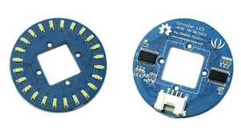
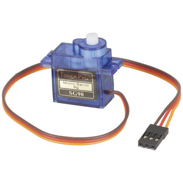

## Chapter 6 -- Grove

Grove is just a plug and socket to plug in stuff (called modules) like sensors or buttons!

They have 4 pins:
1. Signal
2. Signal
3. Power
4. Ground

The important thing to remember is **P3** is *always* power and **P4** is *always* ground. Many modules might only use pin 1, the pins that are used should be marked on the module. Here is the markings on the Grove Button:

Pin 1 is the `SIG`, so that is the pin that sends the button signal on. Pin 2 in `NC` which stands for *not connected*. `VCC` means *power*, and `GND` is *ground*.

We have made micro:bit adapters for NCSS, which have 4 grove connectors and a speaker.

The pin connections on each connector, from right to left, are:

- 0 and 13
- 1 and 14
- 2 and 15
- 19 and 20

`pin0` is also the speaker, some adapters do not have a speaker attached (you can't use both).

### Summary Table
| Sensor | Type | Description |
| --- | --- | --- |
| Buttons | Digital |Detects Presses |
| Buttons with LEDs| Digital | Detects Presses and also lights up |
| Tilt Switch | Digital | Detects when module is tilted beyond a certain point |
| Magnetic Switch | Digital | Detects presence of a magnetic field |
| Hall Effect Switch | Digital | Detects polarity of a magnetic field |
| Potentiometer | Analog | Turnable Knob |
| Rotary Encoder | Digital | Turnable Knob in Discrete Steps |
| Joystick | Analog | X/Y potentiometer with Z-button |
| Continuous Rotation Servo | Digital PWM | Continuouly rotates at a given speed |
| Angle Servo | Digital PWM | Rotates to a given angle |
| Infrared Reflective Sensor | Digital | Senses proximity |
| PIR Motion Sensor | Digital | Detects movement |
| LDR | Analog | Detects light intensity |
| Sound Pressure Sensor | Analog | Detects loudness |
| Loudness Sensor | Analog | Detects loudness with adjustable gain |
| Ultrasonic Distance | Digital | Distance Sensor |
| Multi Colour Flash LED | Digital | Flashes between colours |
| Circular LED | Digital | 24 programmable LEDS |
| LED Bar | Digital | LED Bar chart |
| Flex Sensor | Analog | Detects bending |

### Grove components

A non-exhaustive list of grove components that we have available, as well as a short description of each is given below.

#### Infrared reflective sensor
This is a proximity and colour sensor. In other words, it can detect the presence of close by objects and distinguish the difference between light and dark colored objects. Meaning you could get the robot to avoid crashes by detecting the walls first!

#### PIR motion sensor (passive infrared sensor)
Movement from humans, animals and other moving objects can be detected using the PIR motion sensor.

#### Multi colour flash LED (party LED)
Just like a disco! Like a "party LED", it quickly flashes between bright colours.

#### LED buttons (red, yellow, blue)

#### Button

#### Circular LED

#### Hall sensor (magnet sensor)
Used to measure the magnitude of a magnetic field.

#### Magnetic switch
Good for measuring proximity, the magnetic switch turns on or off when a magnetic field is detected nearby.

#### Loudness and sound sensor
The loudness and sound sensors are very similar, in that they both contain microphones, and both detect loudness (as opposed to being true microphones), have an analogue output and recognize the presence of sound. However, while the grove sound sensor has a fixed gain, the loudness sensor has an adjustable gain. In addition to this, the filtering on the loudness sensor has a lower cutoff, so it will respond to changes in loudness slower.

#### Encoder
Whenever you need a rotating knob, for example as a volume changer, then the encoder is for you! It encodes the rotational movement and outputs it as an electronic pulse.

#### Tilt switch
Tilting the switch different directions causes the sensor to give output as either True or False.

#### Thumb joystick

#### Servos
Connecting other components to servos allows them to be moved and rotated,

